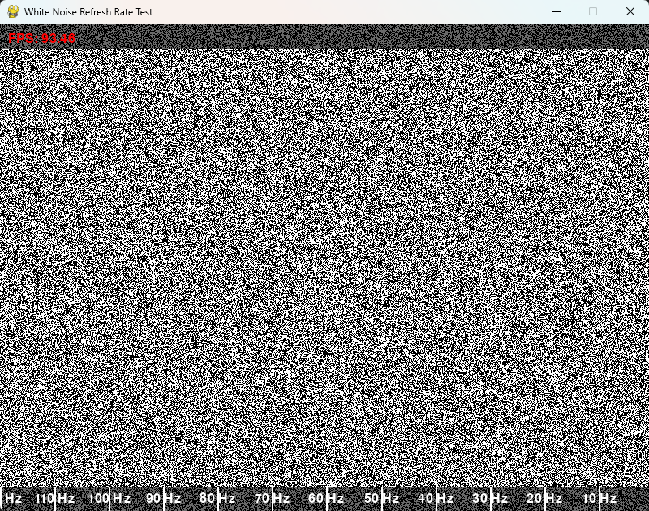

# White Noise Refresh Rate Test

This application is designed to test how the human eye perceives different refresh rates when displaying white noise.

## Overview

The application generates random noise columns using Pygame and numpy. Each column of noise is updated at a refresh rate that varies linearly across the screen. The left side updates quickly (FAST_RATE) and the right side updates slowly (SLOW_RATE), allowing you to observe the change in perception.

## Features

- Generates white noise using Pygame and numpy
- Varies refresh rate linearly across the screen
- Displays the current FPS
- Provides visual reference lines for refresh rates
- Pause/play functionality using the space bar
- Quit functionality using the Escape key

## Screenshot



## Usage

1. Run the application using Python.
2. Observe the noise and FPS display on the screen.
3. Use the space bar to pause/resume the noise generation.
4. Press Escape to exit the application.

## License

This project is licensed under the MIT License. 

```
MIT License

Copyright (c) [Year] [Your Name]

Permission is hereby granted, free of charge, to any person obtaining a copy
of this software and associated documentation files (the "Software"), to deal
in the Software without restriction, including without limitation the rights
to use, copy, modify, merge, publish, distribute, sublicense, and/or sell
copies of the Software, and to permit persons to whom the Software is
furnished to do so, subject to the following conditions:

THE SOFTWARE IS PROVIDED "AS IS", WITHOUT WARRANTY OF ANY KIND, EXPRESS OR
IMPLIED, INCLUDING BUT NOT LIMITED TO THE WARRANTIES OF MERCHANTABILITY,
FITNESS FOR A PARTICULAR PURPOSE AND NONINFRINGEMENT. IN NO EVENT SHALL THE
AUTHORS OR COPYRIGHT HOLDERS BE LIABLE FOR ANY CLAIM, DAMAGES OR OTHER
LIABILITY, WHETHER IN AN ACTION OF CONTRACT, TORT OR OTHERWISE, ARISING FROM,
OUT OF OR IN CONNECTION WITH THE SOFTWARE OR THE USE OR OTHER DEALINGS IN THE
SOFTWARE.
```